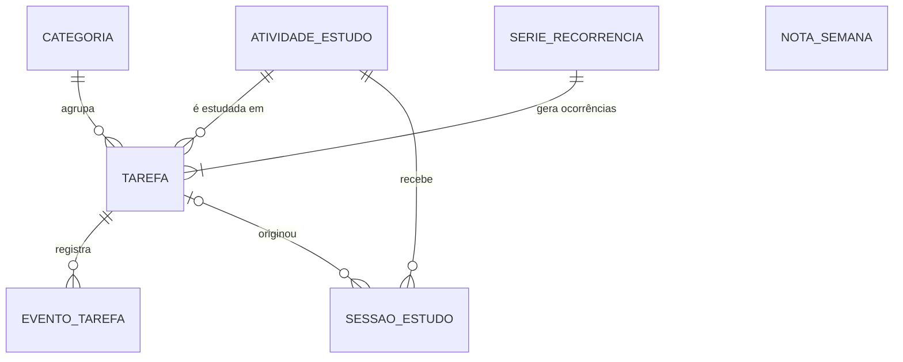

# Guia do backend — OrbitAPI (Java + Spring Boot)

Guia para implementar a API que o OrbitWeb consome. Ele diz **o que** a API precisa guardar,
receber, calcular e devolver, e como isso se liga ao front. O **como** do Spring (camadas,
mapeamento JPA, transações) fica a critério do backend.

| Documento | Conteúdo |
|---|---|
| [`api-contrato.md`](api-contrato.md) | Cada endpoint em detalhe: parâmetros, corpos, respostas, códigos e erros. **É a referência final dos formatos JSON.** |
| [`regras-negocio.md`](regras-negocio.md) | Regras funcionais com exemplos (prazo, recorrência, métricas…). |
| `backend.md` (este) | Entidades, enums, DTOs, validações, erros, datas e fluxos, do ponto de vista de quem implementa. |

O front já funciona inteiro contra um **simulador** que responde às mesmas rotas
(`src/dados/simulacao/`). Quando houver dúvida sobre um comportamento, o simulador é a
implementação de referência: os manipuladores em `src/dados/simulacao/manipuladores/` mostram,
rota por rota, o que o front espera.

Onde uma decisão ainda é do backend, o texto diz **A DEFINIR NO BACKEND**.

---

## 1. Escopo

- **Uso individual, sem login**, na primeira versão. Não existe entidade `Usuario`.
- Login e múltiplos usuários são previstos para o futuro. Quando vierem, todas as entidades raiz
  (tarefa, série, categoria, atividade, sessão, evento, nota) precisarão pertencer a um usuário.
  Modelagem e momento: **A DEFINIR NO BACKEND**.
- 27 endpoints, listados em [`api-contrato.md` › Índice](api-contrato.md#3-índice-de-endpoints).
- Banco de dados: PostgreSQL, schema `orbitapi`, migrations com Flyway.
- URL base: `http://localhost:9018/OrbitAPI/v1` em dev e porta `9028` em prod
  ([`api-contrato.md` › 1.1](api-contrato.md#11-url-base)). O front só precisa dela em
  `VITE_URL_API`.

---

## 2. Entidades

### 2.1 Visão geral



| Entidade | Persistida | Objetivo |
|---|---|---|
| `Tarefa` | Sim | O que a pessoa precisa fazer; cada ocorrência de uma série também é uma `Tarefa` |
| `SerieRecorrencia` | Sim | A regra de repetição e até onde as ocorrências já foram geradas |
| `Categoria` | Sim | Agrupa tarefas, com cor |
| `AtividadeEstudo` | Sim | Assunto estudado no cronômetro, com meta semanal opcional |
| `SessaoEstudo` | Sim | Um período de estudo salvo (cronômetro ou manual) |
| `EventoTarefa` | Sim | Registro do que aconteceu com uma tarefa (base do Histórico) |
| `NotaSemana` | Sim | Texto livre de uma semana |

Não são entidades, e sim **leituras calculadas** a cada requisição: `Prazo` da tarefa, registro do
Histórico, resumo do Dashboard, sequência de dias, mapa de calor, progresso das metas, resumo de
estudos, resumo do calendário e revisão semanal.

### 2.2 `Tarefa`

**Objetivo:** uma tarefa simples, ou uma ocorrência de uma série recorrente.

| Campo | Tipo Java | Obrigatório | Valores / regra |
|---|---|---|---|
| `id` | `Long` | Sim | Gerado |
| `titulo` | `String` | Sim | 1 a 120 caracteres |
| `descricao` | `String` | Não | Até 2000 caracteres |
| `data` | `LocalDate` | Não | `null` = sem data |
| `diaInteiro` | `boolean` | Sim | `true` quando não há horário |
| `horarioInicio` | `LocalTime` | Não | Exige `data` |
| `horarioFim` | `LocalTime` | Não | Exige `horarioInicio`; maior que ele |
| `prioridade` | `Prioridade` | Sim | Padrão `MEDIA` |
| `situacao` | `Situacao` | Sim | Padrão `PENDENTE` |
| `categoria` | `Categoria` | Não | N:1 |
| `atividade` | `AtividadeEstudo` | Não | N:1 |
| `lembreteMinutosAntes` | `Integer` | Não | `0`, `5`, `15`, `30` ou `60`; exige data e horário de início |
| `serie` | `SerieRecorrencia` | Não | N:1; presente nas tarefas recorrentes |
| `dataConclusao` | `OffsetDateTime` / `Instant` | Não | Só com `situacao = CONCLUIDA` |
| `criadoEm` | `OffsetDateTime` / `Instant` | Sim | |
| `atualizadoEm` | `OffsetDateTime` / `Instant` | Sim | Muda a cada alteração |

`prazo` **não é coluna**: é calculado a cada leitura (seção 8.2).

`recorrencia` no `TarefaDTO` é a regra da série da tarefa (`frequencia`, `diasSemana`, `dataFim`),
lida da `SerieRecorrencia`. O simulador copia a regra em cada ocorrência; o backend pode ler da
série.

### 2.3 `SerieRecorrencia`

**Objetivo:** guardar a regra de uma tarefa recorrente e controlar a geração das ocorrências.

| Campo | Tipo Java | Obrigatório | Regra |
|---|---|---|---|
| `id` | `Long` | Sim | Exposto como `serieId` nas tarefas |
| `dataInicial` | `LocalDate` | Sim | Data da primeira ocorrência |
| `frequencia` | `Frequencia` | Sim | |
| `diasSemana` | `Set<DiaSemana>` | Só em `DIAS_DA_SEMANA` | Pelo menos um |
| `dataFim` | `LocalDate` | Não | `null` = nunca termina |
| `geradaAte` | `LocalDate` | Sim | Última data já gerada; controla a extensão da janela |

**Relacionamentos:** 1:N com `Tarefa`.

**Regras:** [recorrência R1 a R15](regras-negocio.md#4-recorrência). A série fica sem ocorrências
anteriores quando é encerrada na data da própria primeira ocorrência; nesse caso ela deixa de
existir.

### 2.4 `Categoria`

| Campo | Tipo Java | Obrigatório | Regra |
|---|---|---|---|
| `id` | `Long` | Sim | |
| `nome` | `String` | Sim | Até 40 caracteres, espaços extras reduzidos, único sem diferenciar maiúsculas ([CA1–CA2](regras-negocio.md#75-categorias)) |
| `cor` | `Cor` | Sim | |

**Relacionamentos:** 1:N com `Tarefa`. O cadastro é feito pela tela de Configurações
(`POST`, `PUT` e `DELETE /categorias`). Excluir uma categoria deixa as tarefas dela com
`categoria = null` (CA5). A resposta inclui `quantidadeTarefas`, calculada numa consulta de contagem
agrupada por categoria, e não guardada na entidade. Dados iniciais são opcionais; o simulador
começa com "Estudos", "Trabalho", "Casa e família" e "Saúde".

### 2.5 `AtividadeEstudo`

| Campo | Tipo Java | Obrigatório | Regra |
|---|---|---|---|
| `id` | `Long` | Sim | |
| `nome` | `String` | Sim | 1 a 40 caracteres, espaços extras reduzidos; único entre as não arquivadas, sem diferenciar maiúsculas |
| `cor` | `Cor` | Sim | |
| `metaSemanalMinutos` | `Integer` | Não | 1 a 6000 |
| `arquivada` | `boolean` | Sim | Padrão `false` |

**Relacionamentos:** 1:N com `SessaoEstudo`; 1:N com `Tarefa`.

**Regras:** [A1 a A8](regras-negocio.md#71-atividades). A unicidade vale só entre as ativas; por
isso não é uma restrição simples de banco (duas arquivadas, ou uma arquivada e uma ativa, podem ter
o mesmo nome). No OrbitAPI ela é um índice único parcial do PostgreSQL,
`(lower(nome)) WHERE NOT arquivada`, além da checagem no serviço que dá a mensagem do `409`.

### 2.6 `SessaoEstudo`

| Campo | Tipo Java | Obrigatório | Regra |
|---|---|---|---|
| `id` | `Long` | Sim | |
| `atividade` | `AtividadeEstudo` | Sim | N:1 |
| `tarefa` | `Tarefa` | Não | N:1; se a tarefa for excluída, a sessão continua e a referência fica nula |
| `modo` | `ModoCronometro` | Sim | Não muda depois de criada |
| `origem` | `OrigemSessao` | Sim | Não muda depois de criada |
| `inicio` | `OffsetDateTime` / `Instant` | Sim | Define o dia da sessão |
| `fim` | `OffsetDateTime` / `Instant` | Sim | `>= inicio` |
| `duracaoSegundos` | `int` | Sim | 60 a 86400; `<= (fim − inicio) + 1 s` |
| `ciclosConcluidos` | `Integer` | Não | Só em `POMODORO` |
| `observacao` | `String` | Não | Até 500 caracteres |

**Regras:** [SE1 a SE8](regras-negocio.md#72-sessões).

### 2.7 `EventoTarefa`

**Objetivo:** registro imutável do que aconteceu com uma tarefa. Alimenta o Histórico, a
"Atividade recente" do Dashboard e as "tarefas criadas" da Revisão semanal.

| Campo | Tipo Java | Obrigatório | Regra |
|---|---|---|---|
| `id` | `Long` | Sim | Exposto como `evento-{id}` |
| `tipo` | `TipoEventoTarefa` | Sim | |
| `tarefa` | `Tarefa` | Sim | N:1; **excluído junto com a tarefa** |
| `titulo` | `String` | Sim | Título da tarefa no momento do evento |
| `ocorridoEm` | `OffsetDateTime` / `Instant` | Sim | |
| `anterior` | `String` | Não | Valor anterior (prioridade, data ou situação) |
| `novo` | `String` | Não | Valor novo |

Quem grava cada tipo:

| Tipo | Gravado por | `anterior` / `novo` |
|---|---|---|
| `TAREFA_CRIADA` | `POST /tarefas` (só a primeira ocorrência de uma série) | — |
| `TAREFA_CONCLUIDA` | Mudança de situação para `CONCLUIDA` (inclusive na criação) | — |
| `TAREFA_CANCELADA` | Mudança para `CANCELADA` | — |
| `TAREFA_REABERTA` | De `CONCLUIDA`/`CANCELADA` para `PENDENTE`/`EM_ANDAMENTO` | Situação antiga / nova |
| `PRIORIDADE_ALTERADA` | `PUT /tarefas/{id}` com prioridade diferente | `Prioridade` antiga / nova |
| `DATA_ALTERADA` | `PUT /tarefas/{id}` com data diferente; `POST /tarefas/reagendamentos` | Data antiga / nova (`AAAA-MM-DD` ou `null`) |

`SESSAO_ESTUDO` e `TAREFA_NAO_REALIZADA` **não** são eventos gravados: saem das sessões e do prazo
calculado.

### 2.8 `NotaSemana`

| Campo | Tipo Java | Obrigatório | Regra |
|---|---|---|---|
| `inicioSemana` | `LocalDate` | Sim | Chave; sempre um domingo |
| `texto` | `String` | Sim | 1 a 1000 caracteres |
| `atualizadoEm` | `OffsetDateTime` / `Instant` | Sim | |

Uma nota por semana. Texto vazio apaga o registro.

---

## 3. Enums

Os nomes e valores devem ser **exatamente** estes (o front compara o texto).

### `Prioridade`

| Valor | Significado | Onde |
|---|---|---|
| `BAIXA` | Pode esperar | Tarefa, filtros, Dashboard |
| `MEDIA` | Padrão | |
| `ALTA` | Importante | "Importantes" na Revisão |
| `URGENTE` | Precisa de atenção já | Contador "Urgentes" |

Ordem: `BAIXA` < `MEDIA` < `ALTA` < `URGENTE`.

### `Situacao`

| Valor | Significado |
|---|---|
| `PENDENTE` | Ainda não começou |
| `EM_ANDAMENTO` | Começou (inclusive ao iniciar estudo a partir da tarefa) |
| `CONCLUIDA` | Feita; tem `dataConclusao` |
| `CANCELADA` | Não será feita, mas fica no histórico |

### `Prazo` (somente leitura, calculado)

| Valor | Significado |
|---|---|
| `SEM_DATA` | Sem data e não concluída |
| `NO_PRAZO` | Em aberto antes do limite, ou cancelada com data |
| `ATRASADA` | Em aberto depois do limite (a mais recente da série, se recorrente) |
| `NAO_REALIZADA` | Ocorrência recorrente atrasada que não é a mais recente da série |
| `CONCLUIDA_NO_PRAZO` | Concluída até o limite, ou sem data |
| `CONCLUIDA_COM_ATRASO` | Concluída depois do limite |

### `Cor`

`AZUL`, `VERDE`, `AMARELO`, `LARANJA`, `VERMELHO`, `ROSA`, `ROXO`, `CIANO`, `CINZA`. Guardada pelo
nome; o front tem um tom para o tema claro e outro para o escuro. Usada em categorias e atividades.

### `Frequencia`

| Valor | Significado |
|---|---|
| `DIARIA` | Todos os dias |
| `DIAS_DA_SEMANA` | Nos dias de `diasSemana` |
| `SEMANAL` | Toda semana, no dia da semana da primeira ocorrência |
| `MENSAL` | Todo mês, no dia da primeira ocorrência (ou no último dia do mês) |
| `ANUAL` | Todo ano, no dia e mês da primeira ocorrência |

### `DiaSemana`

`DOMINGO`, `SEGUNDA`, `TERCA`, `QUARTA`, `QUINTA`, `SEXTA`, `SABADO` (ordem do domingo ao
sábado). Usado em `RecorrenciaDTO.diasSemana`.

### `EscopoAlteracao`

| Valor | Significado |
|---|---|
| `SOMENTE_ESTA` | A alteração ou exclusão vale só para a ocorrência |
| `ESTA_E_PROXIMAS` | Vale para a ocorrência e as seguintes da série |

Query param `escopo` de `PUT` e `DELETE /tarefas/{id}`.

### `OrdenacaoTarefas`

| Valor | Ordem |
|---|---|
| `DATA` | Data, sem data por último; horário (dia inteiro primeiro); prioridade decrescente |
| `PRIORIDADE` | Prioridade decrescente; depois `DATA` |
| `ATUALIZACAO` | `atualizadoEm` decrescente |

### `ModoCronometro`

`LIVRE` (cronômetro contínuo) e `POMODORO` (ciclos de foco e pausa; só o foco conta).

### `OrigemSessao`

`CRONOMETRO` (salva ao finalizar o cronômetro) e `MANUAL` (lançada à mão).

### `TipoEventoTarefa`, `TipoEventoHistorico`, `TipoEventoRecente`

| Enum | Valores | Onde |
|---|---|---|
| `TipoEventoTarefa` | `TAREFA_CRIADA`, `TAREFA_CONCLUIDA`, `TAREFA_CANCELADA`, `TAREFA_REABERTA`, `PRIORIDADE_ALTERADA`, `DATA_ALTERADA` | Coluna `tipo` de `EventoTarefa` |
| `TipoEventoHistorico` | os 6 acima + `TAREFA_NAO_REALIZADA` + `SESSAO_ESTUDO` | `RegistroHistoricoDTO.tipo` |
| `TipoEventoRecente` | `TAREFA_CRIADA`, `TAREFA_CONCLUIDA`, `TAREFA_CANCELADA`, `TAREFA_REABERTA`, `SESSAO_SALVA` | `EventoRecenteDTO.tipo` (Dashboard) |

### `AreaHistorico`

`TAREFAS` e `ESTUDOS`. Filtro `area` de `GET /historico` e campo `area` do registro.

---

## 4. DTOs

Os nomes abaixo são os mesmos usados pelo front em `src/modelos/`. Os formatos JSON completos,
com exemplos, estão em [`api-contrato.md` › Modelos](api-contrato.md#4-modelos-dtos). Os corpos
pequenos que o front não nomeia receberam um **nome sugerido**.

### 4.1 DTOs de entrada

#### `TarefaEnvioDTO` — `POST /tarefas`, `PUT /tarefas/{id}`

```java
public record TarefaEnvioDTO(
        @NotBlank @Size(max = 120) String titulo,
        @Size(max = 2000) String descricao,
        LocalDate data,
        boolean diaInteiro,
        @JsonFormat(pattern = "HH:mm") LocalTime horarioInicio,
        @JsonFormat(pattern = "HH:mm") LocalTime horarioFim,
        @NotNull Prioridade prioridade,
        @NotNull Situacao situacao,
        Long categoriaId,
        Long atividadeId,
        Integer lembreteMinutosAntes,
        @Valid RecorrenciaDTO recorrencia
) {}
```

| Campo | Tipo | Obrigatório | Tamanho | Formato | Exemplo |
|---|---|---|---|---|---|
| `titulo` | `String` | Sim | 1–120 (após `trim`) | — | `"Levar o carro para a revisão"` |
| `descricao` | `String` | Não | até 2000 | — | `"Pedir para olhar o freio."` |
| `data` | `LocalDate` | Não | — | `AAAA-MM-DD` | `"2026-09-24"` |
| `diaInteiro` | `boolean` | Sim | — | — | `false` |
| `horarioInicio` | `LocalTime` | Não | — | `HH:mm` | `"09:00"` |
| `horarioFim` | `LocalTime` | Não | — | `HH:mm` | `"10:30"` |
| `prioridade` | `Prioridade` | Sim | — | enum | `"ALTA"` |
| `situacao` | `Situacao` | Sim | — | enum | `"PENDENTE"` |
| `categoriaId` | `Long` | Não | — | — | `3` |
| `atividadeId` | `Long` | Não | — | — | `null` |
| `lembreteMinutosAntes` | `Integer` | Não | — | `0, 5, 15, 30, 60` | `30` |
| `recorrencia` | `RecorrenciaDTO` | Não | — | — | `null` |

Validações que dependem de mais de um campo (horários, lembrete, recorrência) e de consulta ao
banco (categoria, atividade) não cabem em anotações simples: faça-as no serviço, **depois** da
normalização descrita em [`api-contrato.md` › 5.3](api-contrato.md#53-post-tarefas). Lista
completa e mensagens na mesma seção.

#### `RecorrenciaDTO`

```java
public record RecorrenciaDTO(
        @NotNull Frequencia frequencia,
        Set<DiaSemana> diasSemana,
        LocalDate dataFim
) {}
```

| Campo | Obrigatório | Regra |
|---|---|---|
| `frequencia` | Sim | |
| `diasSemana` | Só em `DIAS_DA_SEMANA` | Pelo menos um; `null` nas outras frequências |
| `dataFim` | Não | `>= data` da tarefa |

O front envia e espera `diasSemana` como **lista** JSON. Na resposta, a ordem de domingo a sábado
é a mais natural (o front reordena de qualquer forma).

#### `SituacaoTarefaDTO` (nome sugerido) — `PATCH /tarefas/{id}/situacao`

```java
public record SituacaoTarefaDTO(@NotNull Situacao situacao) {}
```

#### `ReagendamentoDTO` — `POST /tarefas/reagendamentos`

```java
public record ReagendamentoDTO(@NotEmpty List<@Valid ItemReagendamentoDTO> itens) {}

public record ItemReagendamentoDTO(@NotNull Long id, @NotNull LocalDate data) {}
```

#### `AtividadeEnvioDTO` — `POST /atividades`, `PUT /atividades/{id}`

```java
public record AtividadeEnvioDTO(
        @NotBlank @Size(max = 40) String nome,
        @NotNull Cor cor,
        @Positive @Max(6000) Integer metaSemanalMinutos
) {}
```

A unicidade do nome (`409`) é verificada no serviço, depois de normalizar o nome.

#### `ArquivamentoAtividadeDTO` (nome sugerido) — `PATCH /atividades/{id}/arquivamento`

```java
public record ArquivamentoAtividadeDTO(@NotNull Boolean arquivada) {}
```

#### `SessaoEnvioDTO` — `POST /sessoes`, `PUT /sessoes/{id}`

```java
public record SessaoEnvioDTO(
        @NotNull @Positive Long atividadeId,
        Long tarefaId,
        ModoCronometro modo,
        OrigemSessao origem,
        @NotNull OffsetDateTime inicio,
        @NotNull OffsetDateTime fim,
        @Min(60) @Max(86400) int duracaoSegundos,
        Integer ciclosConcluidos,
        @Size(max = 500) String observacao
) {}
```

| Campo | Exemplo |
|---|---|
| `atividadeId` | `1` |
| `tarefaId` | `42` ou `null` |
| `modo` | `"POMODORO"` |
| `origem` | `"CRONOMETRO"` |
| `inicio` | `"2026-09-24T21:00:00.000Z"` |
| `fim` | `"2026-09-24T21:58:00.000Z"` |
| `duracaoSegundos` | `3000` |
| `ciclosConcluidos` | `2` |
| `observacao` | `"Revisei a lição 12."` |

Validações cruzadas (fim ≥ início, duração ≤ intervalo, nada no futuro, atividade existente e não
arquivada) ficam no serviço: [`api-contrato.md` › 8.2](api-contrato.md#82-post-sessoes).

#### `NotaSemanaEnvioDTO` (nome sugerido) — `PUT /revisao-semanal/{inicioSemana}/nota`

```java
public record NotaSemanaEnvioDTO(@NotNull String texto) {}
```

O limite de 1000 caracteres vale **depois do `trim`**; texto vazio apaga a nota, então não use
`@NotBlank`.

### 4.2 DTOs de saída

```java
public record TarefaDTO(
        Long id, String titulo, String descricao, LocalDate data, boolean diaInteiro,
        @JsonFormat(pattern = "HH:mm") LocalTime horarioInicio,
        @JsonFormat(pattern = "HH:mm") LocalTime horarioFim,
        Prioridade prioridade, Situacao situacao, Prazo prazo,
        ResumoCategoriaDTO categoria, ResumoAtividadeDTO atividade,
        Integer lembreteMinutosAntes, Long serieId, RecorrenciaDTO recorrencia,
        OffsetDateTime dataConclusao, OffsetDateTime criadoEm, OffsetDateTime atualizadoEm
) {}

public record ResumoCategoriaDTO(Long id, String nome, Cor cor) {}
public record ResumoAtividadeDTO(Long id, String nome, Cor cor) {}
public record CategoriaDTO(Long id, String nome, Cor cor, long quantidadeTarefas) {}

public record CategoriaEnvioDTO(String nome, Cor cor) {}
public record DiaCalendarioDTO(LocalDate data, int quantidade, Prioridade maiorPrioridade, int atrasadas, int concluidas) {}

public record AtividadeEstudoDTO(Long id, String nome, Cor cor, Integer metaSemanalMinutos, boolean arquivada) {}
public record ResumoTarefaSessaoDTO(Long id, String titulo) {}
public record SessaoEstudoDTO(
        Long id, ResumoAtividadeDTO atividade, ResumoTarefaSessaoDTO tarefa,
        ModoCronometro modo, OrigemSessao origem, OffsetDateTime inicio, OffsetDateTime fim,
        int duracaoSegundos, Integer ciclosConcluidos, String observacao
) {}

public record PaginaDTO<T>(List<T> itens, int pagina, int tamanho, long totalItens, int totalPaginas) {}
```

Os DTOs de leitura agregada — `ResumoEstudosDTO`, `ProgressoMetaDTO`, `MapaCalorDTO`,
`RegistroHistoricoDTO`, `DetalheHistoricoDTO`, `RevisaoSemanalDTO` (com `ResumoSemanaDTO`,
`DiaRevisaoDTO`, `EstudosSemanaDTO`, `TarefasSemanaDTO`, `ProximaSemanaDTO`, `NotaSemanaDTO`),
`ResumoDashboardDTO` (com `EventoRecenteDTO`) e `SequenciaDTO` — estão descritos campo a campo,
com a regra de cálculo de cada um, nas seções 9 a 12 do [contrato](api-contrato.md).

Regras gerais de saída:

- campos sem valor saem como `null` (não omita com `@JsonInclude(NON_NULL)` nos DTOs de sucesso);
- instantes em ISO 8601 com fuso (`WRITE_DATES_AS_TIMESTAMPS = false`);
- datas em `AAAA-MM-DD`, horários em `HH:mm`;
- `RegistroHistoricoDTO.id` é **texto** (`evento-12`, `sessao-45`, `nao-realizada-67`).

---

## 5. Endpoints

A lista completa, com todos os detalhes, está em
[`api-contrato.md` › Índice](api-contrato.md#3-índice-de-endpoints). Resumo por controlador
sugerido:

| Controlador | Rotas |
|---|---|
| Tarefas | `GET/POST /tarefas`, `GET/PUT/DELETE /tarefas/{id}`, `PATCH /tarefas/{id}/situacao`, `POST /tarefas/reagendamentos`, `GET /tarefas/resumo-calendario` |
| Categorias | `GET/POST /categorias`, `PUT/DELETE /categorias/{id}` |
| Atividades | `GET/POST /atividades`, `PUT/DELETE /atividades/{id}`, `PATCH /atividades/{id}/arquivamento` |
| Sessões | `GET/POST /sessoes`, `PUT/DELETE /sessoes/{id}` |
| Estudos | `GET /estudos/resumo`, `GET /estudos/progresso-semanal`, `GET /estudos/mapa-calor` |
| Histórico | `GET /historico`, `GET /historico/{id}` |
| Revisão semanal | `GET /revisao-semanal`, `PUT /revisao-semanal/{inicioSemana}/nota` |
| Dashboard | `GET /dashboard/resumo`, `GET /dashboard/sequencia` |

Não crie rotas além destas sem combinar com o front: rotas não usadas não fazem parte do contrato.

---

## 6. Filtros, paginação e ordenação

| Rota | Filtros | Paginação | Ordenação |
|---|---|---|---|
| `GET /tarefas` | `data`, `dataInicial`, `dataFinal`, `semData`, `situacao` (lista), `prioridade` (lista), `prazo`, `categoriaId`, `busca` | `pagina` (0), `tamanho` (20, máx. 100) | `ordenacao`: `DATA` (padrão), `PRIORIDADE`, `ATUALIZACAO` |
| `GET /sessoes` | `dataInicial`, `dataFinal`, `atividadeId` | `pagina`, `tamanho` (20, máx. 100) | Fixa: `inicio` decrescente |
| `GET /historico` | `dataInicial`*, `dataFinal`*, `area`, `busca` | `pagina`, `tamanho` (30, máx. 100) | Fixa: `ocorridoEm` decrescente, depois `id` |
| `GET /estudos/resumo` | `dataInicial`, `dataFinal`, `atividadeId` | — | Fixa |
| `GET /tarefas/resumo-calendario`, `GET /estudos/mapa-calor`, `GET /dashboard/resumo` | `dataInicial`*, `dataFinal`* | — | Por data |
| `GET /estudos/progresso-semanal`, `GET /revisao-semanal` | `inicioSemana`* | — | — |

\* obrigatório.

Pontos de atenção:

1. **Os nomes são `pagina`, `tamanho` e `ordenacao`**, não `page`, `size` e `sort`. Leia com
   `@RequestParam` e monte o `PageRequest`; não exponha `Pageable` direto, ou o Spring passará a
   esperar `page`/`size`.
2. **A resposta é `PaginaDTO`**, não o JSON de `Page` do Spring.
3. **`situacao` e `prioridade` chegam repetidos** (`?situacao=A&situacao=B`): use `List<…>`.
4. **`busca` em tarefas** procura no título e na descrição; **no histórico**, no título, no nome
   da categoria e no nome da atividade. As duas sem diferenciar maiúsculas.
5. **`prazo=ATRASADA` filtra por um valor calculado** e ainda precisa respeitar a paginação. O
   filtro tem de ser expresso na consulta (seção 8.2), e não aplicado depois de paginar.
6. **O histórico junta três origens** (eventos, sessões e não realizadas) numa só lista paginada e
   ordenada. Uma consulta `UNION` com a ordenação e o `LIMIT/OFFSET` aplicados sobre o resultado
   é o caminho mais direto; montar em memória só funciona enquanto o volume for pequeno.
   Estratégia: **A DEFINIR NO BACKEND**.

---

## 7. Datas, horários e fuso

Resumo das regras (detalhes em [`api-contrato.md` › 1.4](api-contrato.md#14-datas-horários-instantes-e-fuso)):

| Conceito | Tipo | Formato |
|---|---|---|
| Data | `LocalDate` | `AAAA-MM-DD` |
| Horário | `LocalTime` | `HH:mm` — use `@JsonFormat(pattern = "HH:mm")` |
| Instante | `OffsetDateTime` ou `Instant` | ISO 8601 com fuso |
| Duração de sessão | `int` | segundos |
| Agregados de estudo | `int` | minutos (cada sessão arredondada antes de somar) |

**Fuso da requisição.** O front manda `X-Fuso-Horario: America/Sao_Paulo` (IANA) em toda
requisição. Sugestão de implementação:

1. Um filtro ou `HandlerInterceptor` lê o cabeçalho, valida com `ZoneId.of(...)` e guarda o
   `ZoneId` num objeto de escopo de requisição.
2. Os serviços recebem esse `ZoneId` e um `Clock` injetado (facilita os testes).
3. Tudo o que depende de "hoje" ou de "em que dia caiu" usa esse fuso:
   - `LocalDate hoje = LocalDate.now(clock.withZone(fuso))`;
   - dia de uma sessão: `inicio.atZoneSameInstant(fuso).toLocalDate()`;
   - limite de uma tarefa: `ZonedDateTime.of(data, horarioFim, fuso)` ou
     `data.plusDays(1).atStartOfDay(fuso)`.

Cabeçalho ausente ou inválido: `America/Sao_Paulo`, sem erro. No OrbitAPI, o
`FusoHorarioService` lê o cabeçalho da requisição atual e devolve o `ZoneId`, e o `Clock` é um bean
(`ClockConfig`, em UTC).

**Semana:** domingo a sábado. Para achar o domingo:
`data.with(TemporalAdjusters.previousOrSame(DayOfWeek.SUNDAY))`.

**Guardar instantes em UTC** no banco evita ambiguidade; a conversão para o dia da pessoa acontece
só na leitura.

---

## 8. Regras de negócio para implementar

A lista completa está em [`regras-negocio.md`](regras-negocio.md). Estas são as que mais pesam na
modelagem.

### 8.1 Validação e normalização

Normalize antes de validar (remover espaços, limpar horários de tarefas sem data, forçar dia
inteiro sem horário, limpar lembrete sem horário, limpar `diasSemana` fora de `DIAS_DA_SEMANA`).
A tabela completa está em [`api-contrato.md` › 5.3](api-contrato.md#53-post-tarefas). O front já
envia normalizado, mas o backend é a fonte da verdade.

As mensagens de validação aparecem na tela (via `errors[].mensagem` ou `detail`): escreva-as em
português, dizendo o que fazer. As sugeridas no contrato são as que o front mostra hoje.

### 8.2 Prazo

```text
limite(tarefa) =
    null                                   se data == null
    data às horarioFim (no fuso)           se tem horarioFim e não é dia inteiro
    início do dia seguinte (no fuso)       nos demais casos

prazo(tarefa) =
    CONCLUIDA:  limite == null ou dataConclusao <= limite → CONCLUIDA_NO_PRAZO
                senão                                     → CONCLUIDA_COM_ATRASO
    sem data:                                              SEM_DATA
    CANCELADA:                                             NO_PRAZO
    em aberto:  agora >= limite → ATRASADA, senão NO_PRAZO

depois, para cada série:
    entre as ocorrências ATRASADA, só a de maior (data, horarioInicio) continua ATRASADA;
    as outras viram NAO_REALIZADA
```

Onde o prazo é usado como **filtro ou contagem** (`GET /tarefas?prazo=ATRASADA`, contadores do
Dashboard e da Revisão, marcadores do calendário, não realizadas no Histórico), ele precisa ser
calculado na consulta. Em SQL, a regra de "mais recente da série" cabe numa função de janela
(`ROW_NUMBER() OVER (PARTITION BY serie_id ORDER BY data DESC, horario_inicio DESC)`) ou num
`NOT EXISTS` com uma ocorrência atrasada posterior da mesma série. No OrbitAPI, a lista usa uma
consulta nativa (`TarefaConsultaRepositoryImpl`) com três CTEs: o limite no fuso da requisição
(`AT TIME ZONE`), o prazo isolado e o `MAX(...) OVER (PARTITION BY serie_id)` da data e horário das
atrasadas, que rebaixa as anteriores a `NAO_REALIZADA`. A leitura de uma tarefa só usa a mesma
regra em Java (`PrazoService`), consultando as ocorrências em aberto da série até hoje.

### 8.3 Recorrência

- Gerar as ocorrências de uma vez ao criar a série (janela de 12 meses) e **estender** a janela
  quando faltarem menos de 3 meses. No OrbitAPI, as leituras de tarefas chamam
  `SerieRecorrenciaService.estender` antes de ler. A consulta pega só as séries com `geradaAte` até
  hoje + 3 meses e ainda antes do término, então quase sempre volta vazia: na prática, a extensão
  acontece na primeira leitura depois que uma série entra nesse prazo. As ocorrências novas copiam
  a última ocorrência da série (e não a primeira), vão de `geradaAte + 1` até hoje + 12 meses e
  recebem `criadoEm` atual; uma série sem nenhuma ocorrência é apagada. A consulta trava as séries
  com `SELECT ... FOR UPDATE`, para leituras simultâneas não gerarem a mesma ocorrência duas vezes. A extensão pode acontecer numa tarefa agendada ou na primeira
  leitura do dia; o simulador estende a cada requisição. Estratégia: **A DEFINIR NO BACKEND**.
- Edição e exclusão com escopo: regras R11 a R14 em
  [`regras-negocio.md`](regras-negocio.md#4-recorrência) e passo a passo em
  [`api-contrato.md` › 5.4](api-contrato.md#54-put-tarefasid).
- Toda edição com `ESTA_E_PROXIMAS` que muda regra ou data mexe em várias linhas e na série:
  faça numa única transação.

### 8.4 Eventos

Grave o evento na mesma transação da alteração que o originou (tabela em 2.7). Exclua os eventos
junto com a tarefa.

### 8.5 Leituras agregadas

Dashboard, Revisão semanal, Histórico, mapa de calor, metas e sequência são **somente leitura** e
calculados na hora a partir de tarefas, sessões e eventos. Não há tabelas de resumo: depois de
qualquer escrita, a próxima leitura precisa refletir a mudança (o front busca de novo logo em
seguida). Se algum cálculo virar gargalo, cache com invalidação por escrita é
**A DEFINIR NO BACKEND**.

---

## 9. Modelo de erro — `ErrorResponseDTO`

O front consome **este** formato; não crie outro.

```java
@JsonInclude(JsonInclude.Include.NON_NULL)
public record ErrorResponseDTO(
        int status,
        String title,
        String instance,
        URI type,
        String detail,
        List<ErroCampoDTO> errors,
        @JsonFormat(shape = JsonFormat.Shape.STRING, pattern = "dd/MM/yyyy - HH:mm:ss") LocalDateTime timestamp
) {}

public record ErroCampoDTO(String campo, String mensagem) {}
```

| Campo | Obrigatório | O que o front faz |
|---|---|---|
| `status` | Sim | Classifica o erro |
| `title` | Sim | Registra no console |
| `instance` | Sim | Registra no console (`request.getRequestURI()`) |
| `type` | Sim | Registra no console; é o campo para identificar um problema específico |
| `detail` | Sim | Mostra na tela em `400`, `404`, `409` e `422` |
| `errors` | Não | Se vier, coloca cada mensagem no campo do formulário |
| `timestamp` | Não | Ignora |

É a mesma estrutura do PrismaAPI (`br.com.prismaapi.exceptions.dto.ErrorResponseDTO`, com
`MethodArgumentNotValidResponseDTO` no lugar de `ErroCampoDTO`). O OrbitAPI inclui `errors` nas
respostas de validação e `timestamp` em todas as de erro.

### 9.1 Exceções e status

| Situação | Status | Exemplo de exceção | `errors`? |
|---|---|---|---|
| Bean Validation no corpo | `400` | `MethodArgumentNotValidException` | Sim, um por campo |
| JSON malformado ou enum inválido | `400` | `HttpMessageNotReadableException` | Não |
| Query param em formato inválido | `400` | `MethodArgumentTypeMismatchException` | Não |
| Regra de validação no serviço (horários, recorrência, sessão, categoria/atividade inexistente) | `400` | exceção de validação da aplicação | Sim, com o `campo` |
| Id do caminho não existe; id citado em reagendamento não existe | `404` | exceção de "não encontrado" da aplicação | Não |
| Rota inexistente | `404` | `NoResourceFoundException` | Não |
| Nome de atividade repetido | `409` | exceção de conflito da aplicação | Sim (`nome`) |
| Excluir atividade com sessões; desarquivar com nome em uso | `409` | exceção de conflito da aplicação | Não |
| Erro inesperado | `500` | `Exception` | Não |

Os tipos genéricos estão definidos em [`api-contrato.md` › 2.5](api-contrato.md#25-tipos-de-erro-type).
Os de cada regra de negócio são registrados na seção do endpoint, junto com o `detail`.

### 9.2 Boas práticas que o front assume

- `detail` de `4xx` é **texto para a pessoa**: português, sem nome de classe, SQL ou pilha.
- `detail` de `5xx` não é exibido; registre o erro completo no log do servidor.
- Todas as respostas de erro são JSON, inclusive `404` de rota e `405` de método.
- O front classifica pelo `status`; mudar um `type` não quebra o front, mudar um `status` quebra.

---

## 10. Fluxos entre entidades

### 10.1 Criar tarefa recorrente

```text
POST /tarefas (recorrencia != null)
  ├─ valida e normaliza o TarefaEnvioDTO
  ├─ grava a Tarefa (primeira ocorrência, data = dataInicial)
  ├─ grava EventoTarefa TAREFA_CRIADA (e TAREFA_CONCLUIDA se já concluída)
  ├─ grava SerieRecorrencia (dataInicial, regra, geradaAte)
  ├─ gera as ocorrências de data+1 até min(dataFim, hoje+12 meses)
  │    └─ cada uma: cópia dos dados, PENDENTE, sem conclusão, mesma série, sem evento
  └─ 201 TarefaDTO (primeira ocorrência, com prazo calculado)
```

### 10.2 Concluir, desfazer e reabrir

```text
PATCH /tarefas/{id}/situacao { CONCLUIDA }
  ├─ situacao = CONCLUIDA, dataConclusao = agora, atualizadoEm = agora
  ├─ EventoTarefa TAREFA_CONCLUIDA
  └─ 200 TarefaDTO (prazo CONCLUIDA_NO_PRAZO ou CONCLUIDA_COM_ATRASO)

"Desfazer" → PATCH { PENDENTE | EM_ANDAMENTO }
  ├─ dataConclusao = null
  ├─ EventoTarefa TAREFA_REABERTA { anterior: CONCLUIDA, novo: … }
  └─ o evento TAREFA_CONCLUIDA continua no histórico
```

### 10.3 Estudar a partir de uma tarefa

```text
PATCH /tarefas/{id}/situacao { EM_ANDAMENTO }   (só se estava PENDENTE)
… cronômetro no navegador …
POST /sessoes { atividadeId, tarefaId, modo, origem: CRONOMETRO, inicio, fim, duracaoSegundos, … }
  ├─ valida (atividade ativa, duração, datas)
  ├─ grava SessaoEstudo ligada à AtividadeEstudo e à Tarefa
  └─ 201 SessaoEstudoDTO
Leituras seguintes: metas, mapa de calor, sequência, Dashboard, Histórico e Revisão já incluem a sessão.
```

### 10.4 Editar "esta e as próximas" mudando a regra

```text
PUT /tarefas/{id}?escopo=ESTA_E_PROXIMAS (recorrencia diferente)
  (uma transação)
  ├─ série antiga: dataFim = data original − 1 (ou apagada se não sobrar ocorrência anterior)
  ├─ ocorrências seguintes em aberto: excluídas, com seus eventos
  ├─ ocorrências seguintes concluídas/canceladas: preservadas
  ├─ esta ocorrência: sai da série antiga, recebe os dados novos
  ├─ nova SerieRecorrencia a partir desta, pulando as datas preservadas
  ├─ eventos PRIORIDADE_ALTERADA / DATA_ALTERADA / situação desta ocorrência
  └─ 200 TarefaDTO
```

### 10.5 Excluir ou arquivar atividade

```text
DELETE /atividades/{id}
  ├─ tem sessões? → 409 (arquive)
  └─ não tem → tarefas ligadas ficam com atividade = null; 204

PATCH /atividades/{id}/arquivamento { arquivada: true }
  └─ some do cronômetro e das metas; sessões e histórico ficam
```

### 10.6 Excluir tarefa

```text
DELETE /tarefas/{id}?escopo=…
  ├─ exclui a tarefa e os EventoTarefa dela
  ├─ ESTA_E_PROXIMAS: exclui as seguintes em aberto e encerra a série na véspera
  └─ sessões ligadas continuam, com tarefa = null
```

---

## 11. Configuração do lado do backend

| Item | Valor |
|---|---|
| CORS | Origem do front (`http://localhost:5173` no desenvolvimento); métodos `GET, POST, PUT, PATCH, DELETE, OPTIONS`; cabeçalhos `Content-Type, Accept, X-Fuso-Horario` |
| Jackson | `WRITE_DATES_AS_TIMESTAMPS = false`; `LocalTime` em `HH:mm`; enums pelo nome |
| Tempo de resposta | O front desiste depois de **15 segundos** e mostra "O servidor demorou demais para responder." |
| Autenticação | Nenhuma na primeira versão |

---

## 12. Ordem sugerida de implementação

1. `ErrorResponseDTO` e o tratador global de exceções (o front depende deles em todas as telas).
2. Leitura do fuso (`X-Fuso-Horario`) e `Clock`.
3. Categorias (CRUD) e atividades (CRUD + arquivamento).
4. Tarefas sem recorrência: CRUD, situação, cálculo de prazo, filtros e paginação, eventos.
5. Reagendamento e resumo do calendário.
6. Recorrência: séries, geração, extensão, escopos.
7. Sessões e leituras de estudo (resumo, metas, mapa de calor).
8. Histórico (linha do tempo e detalhes).
9. Dashboard (resumo e sequência).
10. Revisão semanal e nota.

A cada etapa, basta apontar o front para a API (`VITE_FONTE_DADOS=api`) e usar as telas
correspondentes: as rotas ainda não implementadas vão aparecer como estados de erro isolados, sem
derrubar o resto da página.

---

## 13. Pendências

| # | Assunto | Status |
|---|---|---|
| B1 | URL base (porta, *context-path*, versão) | Resolvida: `/OrbitAPI/v1`, porta 9018 (dev) e 9028 (prod) |
| B2 | Banco de dados | Resolvida: PostgreSQL + Flyway, schema `orbitapi` |
| B3 | `type`, `title` e `detail` de cada erro; inclusão de `errors` e `timestamp` | Resolvida para os genéricos, `errors` e `timestamp`; os de cada regra entram com o endpoint |
| B4 | Estratégia de cálculo do prazo em consultas e da linha do tempo do Histórico | Resolvida: consulta nativa com o prazo no banco (8.2); o Histórico une eventos, sessões e não realizadas com `UNION ALL` na mesma consulta |
| B5 | Momento da extensão das séries recorrentes | Resolvida: nas leituras de tarefas, antes de ler (8.3) |
| B6 | Origem das categorias antes da tela de Configurações | Resolvida: cadastro pela tela de Configurações; dados iniciais opcionais |
| B7 | Fuso padrão sem `X-Fuso-Horario` | Resolvida: `America/Sao_Paulo`, também para valor inválido |
| B8 | Usuários e autenticação | A DEFINIR (fase futura) |
| B9 | Decisões de produto pendentes (R4 × "Mover para hoje"; recorrentes futuras em "Em aberto por prioridade") | A DEFINIR (dono do produto) — ver [`regras-negocio.md`](regras-negocio.md#12-decisões-pendentes) |
